# Bogsalg (Bookstore) Database

A small, production‑style relational database for a bookstore. It organizes customers, books, genres, orders, and order lines, and demonstrates common SQL operations (INSERT, SELECT, UPDATE) with safe, re‑runnable scripts. The schema is normalized and supports multiple different books (and multiple copies) in a single order.

Built for Microsoft SQL Server and tested in SSMS. The diagram is available as an image (diagram.png).

## What this project includes

- A normalized schema with these tables:
  - customers, orders, order_items, books, genres, admin
- Data integrity via primary keys, foreign keys, CHECK constraints, and recommended UNIQUE indexes
- Idempotent SQL scripts (safe to re‑run):
  - Inserts use `IF NOT EXISTS`
  - Order creation is guarded so the same customer+book isn’t double‑created on re‑runs
- Separate scripts per task (insert/select/update), each with a built‑in “check” query
- An ER diagram 

## Diagram

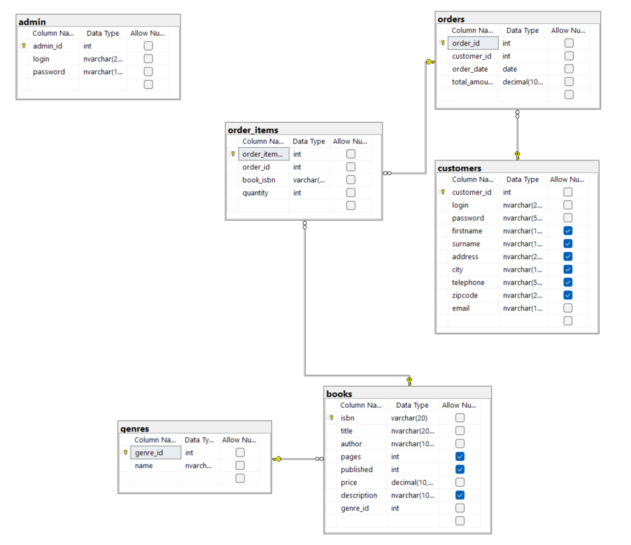

## Screenshots (tasks 1–11)

> All images are stored in [images/](images/).

- Task 1 — INSERT a book with optional fields  
  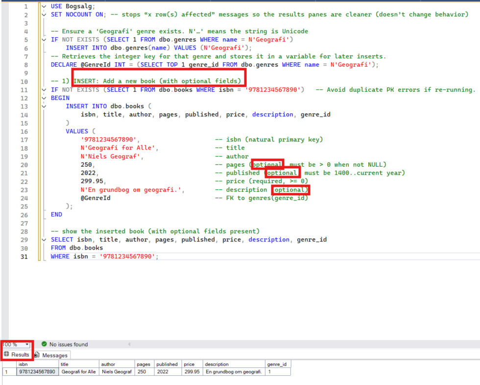

- Task 2 — INSERT a book without optional fields  
  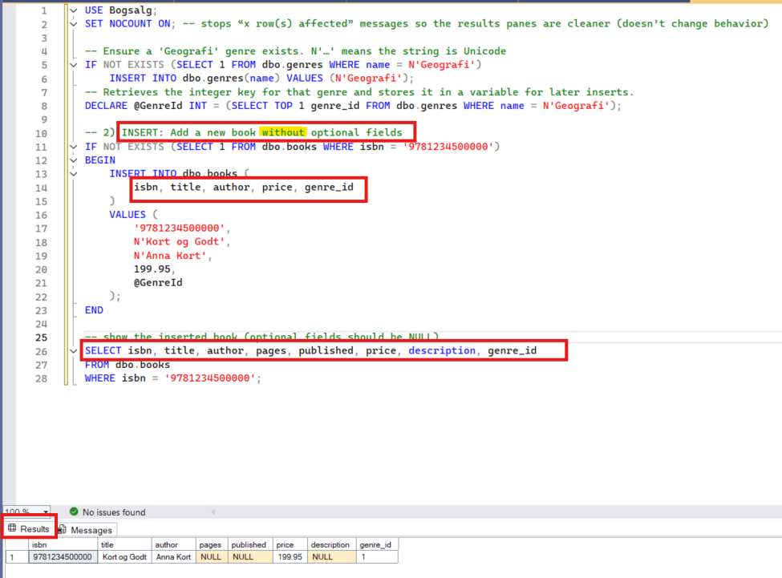

- Task 3 — INSERT an order for a customer who buys a book (steps)  
  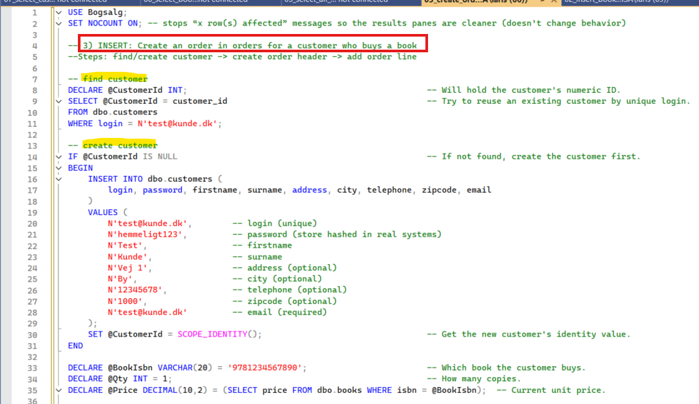  
  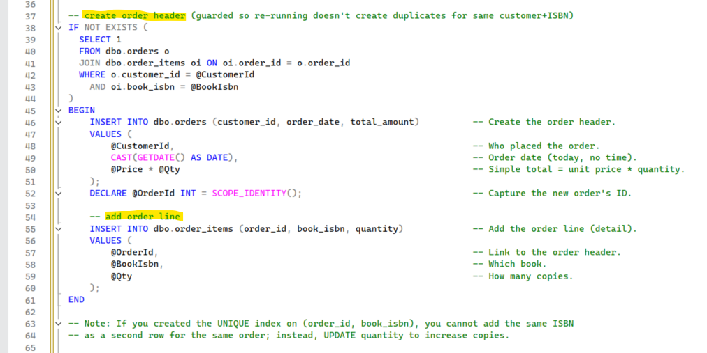  
  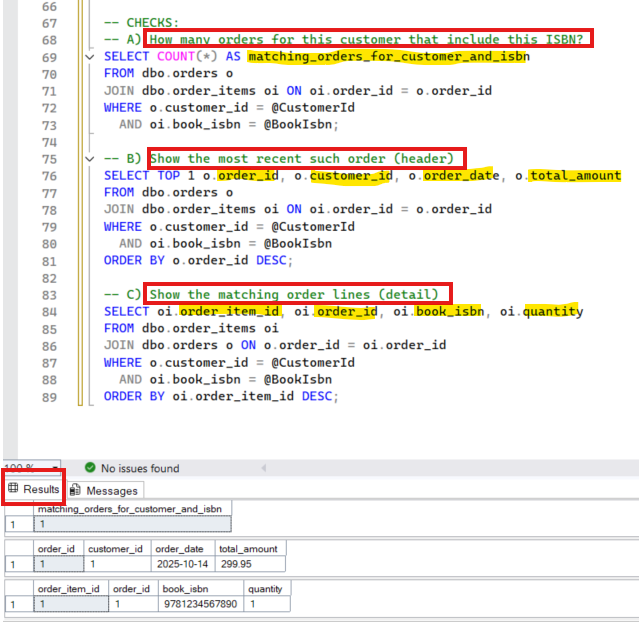

- Task 4 — SELECT all genres  
  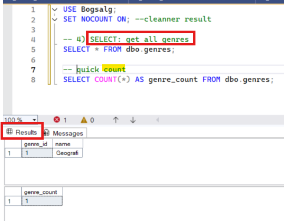

- Task 5 — SELECT all books  
  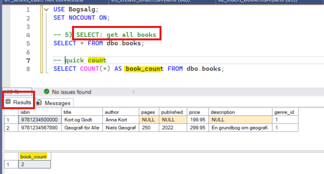

- Task 6 — SELECT books where genre = 'Geografi'  
  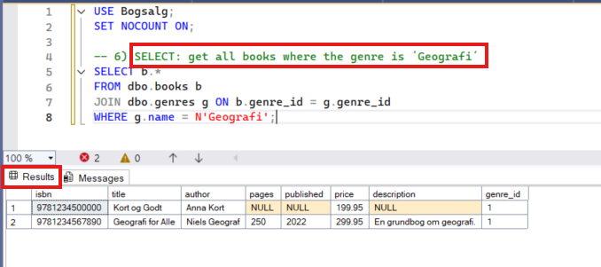

- Task 7 — SELECT customers and their order counts (including zero)  
  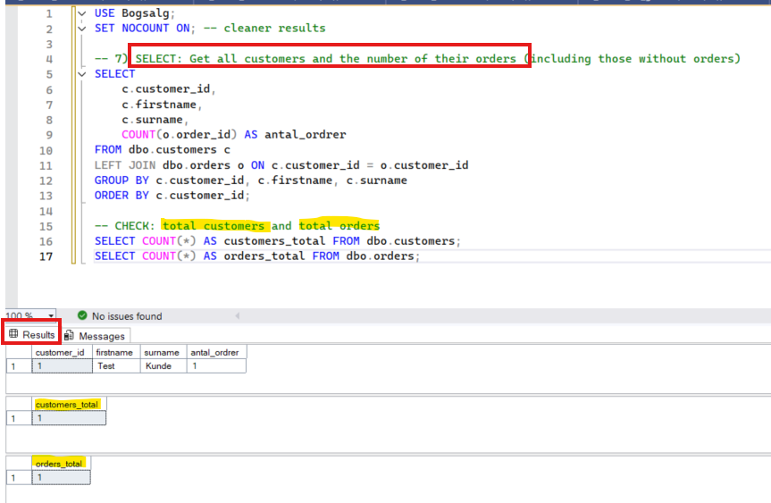

- Task 8 — UPDATE book title  
  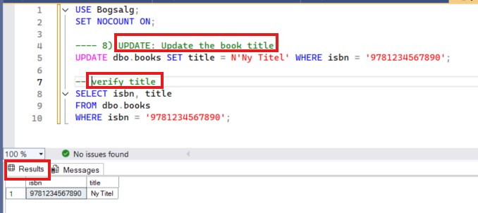

- Task 9 — UPDATE published year  
  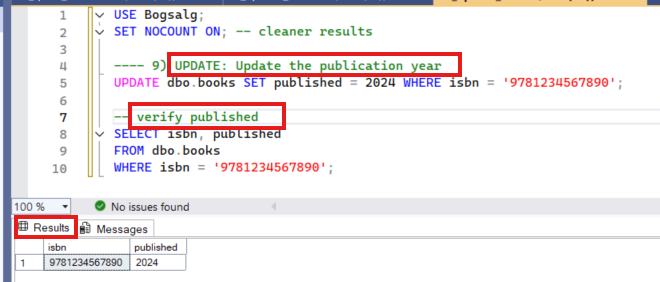

- Task 10 — UPDATE page count  
  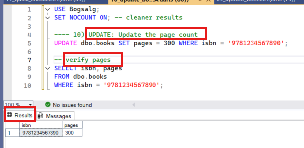

- Task 11 — Quick check after updates  
  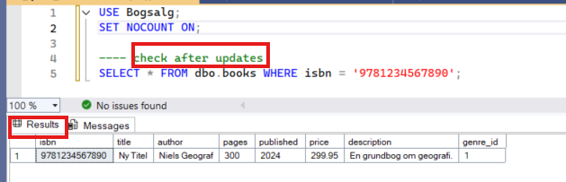

## Scripts (how to run)

1) `schema.sql` — creates tables, keys, constraints, indexes (safe to re‑run)  
2) Use the separate per‑task scripts in `tasks 1 - 11` (each has a quick CHECK at the end)

## Evaluation and Design Considerations

Goal: Support a bookstore database with customers, books, orders, and genres, and allow a single order to include multiple books and multiple copies.

- Multiple books per order:
  - Implemented via a junction table `order_items` with a `quantity` column.
  - Recommended unique index `UNIQUE(order_id, book_isbn)` prevents duplicate lines; increase `quantity` instead.
- Data validation (examples):
  - `books.pages > 0` when provided
  - `books.published` between 1400 and current year when provided
  - `books.price >= 0`, `orders.total_amount >= 0`
- Performance:
  - Index FKs: `books(genre_id)`, `orders(customer_id)`, `order_items(order_id)`, `order_items(book_isbn)`.
- Security:
  - Store `password` fields as secure hashes (e.g., bcrypt/Argon2), not plain text.
- Idempotency:
  - Inserts are guarded with `IF NOT EXISTS`.
  - Order creation is guarded for the same customer+ISBN to avoid duplicates on re‑runs.
 
## Perspective
Next steps: add seed data; create views (books by genre, orders per customer); add a stored procedure to place an order in one transaction; auto‑recalculate order totals; add helpful indexes; export a few simple reports.
For more info check next project.....

## Notes

- Unicode: using N'...' is safer if you ever insert non‑ASCII characters (æ, ø, å) now or later. Use for names/titles/descriptions/logins.
- Security: Passwords are plain text for demo; in real systems, store salted hashes (bcrypt/Argon2)
- Portability: Targets SQL Server. For MySQL, convert `IDENTITY`, `GETDATE()`, `SCOPE_IDENTITY()`, NVARCHAR, and some CHECK constraints.
- `customers.password` and `admin.password` are NVARCHAR columns (not VARBINARY), with no hashing columns. You just insert N'hemmeligt123' directly. There’s no trigger, function, or stored procedure that hashes before saving.
